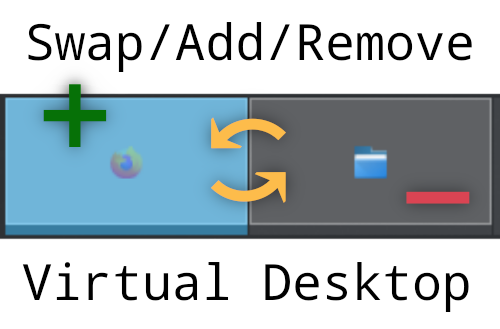

# Swap/Add/Remove - Virtual Desktop Shortcuts

Adds keyboard shortcuts to KWin for swapping, adding and removing virtual desktops. When swapping to the 0th/last+1 desktop, a new desktop will be added to make the swap possible.

Updated to the Plasma 6 API. Works with both Wayland and X11.

### Default shortcuts
| Action                                       | Shortcut                    |
| :------------------------------------------- | :-------------------------- |
| Swap current desktop with next               | Meta + Shift + Alt + Right  |
| Swap current desktop with above              | Meta + Shift + Alt + Up     |
| Swap current desktop with below              | Meta + Shift + Alt + Down   |
| Swap current desktop with previous           | Meta + Shift + Alt + Left   |
| Add new desktop after current                | Meta + Shift + Alt + +      |
| Add new desktop before current               | Meta + Alt + =              |
| Remove current desktop (merge with next)     | Meta + Shift + Alt + _      |
| Remove current desktop (merge with previous) | Meta + Alt + -              |

These can be changed in System Settings → Global Shortcuts → KWin → (search for swapdesktop2)

Quick demo video: https://www.youtube.com/watch?v=TOOlC8laRNQ

## For developers

Cleanup of leftover components can be done by loggin out/in and then running this kde cleanup command:

`qdbus org.kde.kglobalaccel /component/kwin org.kde.kglobalaccel.Component.cleanUp`

## References

1. Plasma scripting API: <https://develop.kde.org/docs/plasma/kwin/api/>
2. Plasma scripting tutorial: <https://develop.kde.org/docs/plasma/kwin/>
3. Plasma scripting tutorial: <https://develop.kde.org/docs/plasma/scripting/>
